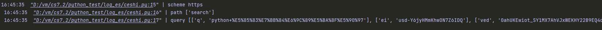
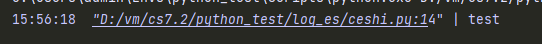
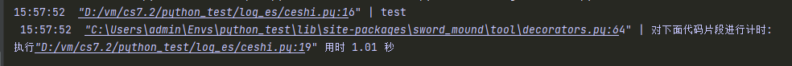
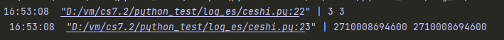

# sword-mound

## 工具
### 1.时间戳转换
```python
from sword_mound import sm_now_timestamp,sm_timestamp_to_time

if __name__ == '__main__':
    """获取当前时间戳"""
    print(sm_now_timestamp(10))
    print(sm_now_timestamp())
    """时间戳转为时间"""
    test =1656311250
    test1 ='1656311250651'
    print(sm_timestamp_to_time(test))
    print(sm_timestamp_to_time(test1))
```


### 2.url解析(自用)
```python
from sword_mound import sm_urlparse

if __name__ == '__main__':
    url_string = 'https://www.google.com/search?q=python+%E5%85%83%E7%BB%84%E6%9C%89%E5%BA%8F%E5%90%97&ei=usd-Y6jyHMmKhwON7Z6IDQ&ved=0ahUKEwiot_SY1MX7AhVJxWEKHY22B9EQ4dUDCA8&uact=5&oq=python+%E5%85%83%E7%BB%84%E6%9C%89%E5%BA%8F%E5%90%97&gs_lcp=Cgxnd3Mtd2l6LXNlcnAQAzIECAAQHjoKCAAQRxDWBBCwAzoFCAAQogQ6BwgAEB4QogQ6CAghEMMEEKABSgQIQRgASgQIRhgAUKEIWJcoYLspaAZwAXgAgAFLiAHcBZIBAjExmAEAoAEByAEHwAEB&sclient=gws-wiz-serp'
    url_dict = sm_urlparse(url_string)
    print('scheme',url_dict['scheme'])
    print('path',url_dict['path'])
    print('query',url_dict['query'])
```


---

## 补丁
### 1.print 补丁
用法直接导入包 在pycharm 和linux 终端会带有颜色 连接可以直接点击会跳转到打印的地方
```python
import sword_mound
def test():
    print('test')

if __name__ == '__main__':
    test()
```


---

## 装饰器
### 1.代码片段计时器

```python
import time
from sword_mound import sm_decorators

def test():
    time.sleep(1)
    print('test')

if __name__ == '__main__':
    with sm_decorators.TimerContextManager():
        test()
```

### 2.计时器
```python
import time
from sword_mound import sm_decorators

@sm_decorators.timer
def test():
    time.sleep(1)
    print('test')

if __name__ == '__main__':
    test()
```


### 3.单例装饰器(带线程锁)
```python
from sword_mound import sm_decorators

@sm_decorators.singleton
class A(object):
    def __init__(self, x):
        self.x = x

a1 = A(3)
a2 = A(4)

print(a1.x, a2.x)
print(id(a1), id(a2))
```
